# pixel-asset-gen

Procedural pixel art game asset generator. Produces complete, game-ready sprite sheets with animations, JSON metadata, texture atlases, and animated GIF previews — all from a single CLI command.

**186 assets** (96 animated, 90 static) across 10 categories — generated procedurally using sine waves, fractal noise, and physics simulation. Zero hand-drawn art required.

## Preview

### Characters

<p>
  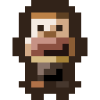
  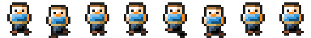
  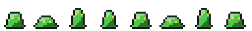
  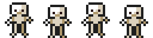
  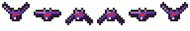
  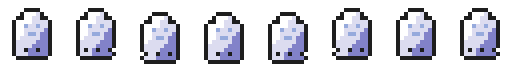
</p>

### Natural Objects

<p>
  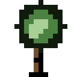
  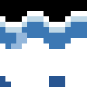
  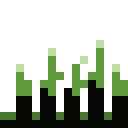
  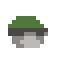
  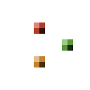
  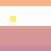
</p>

### Effects

<p>
  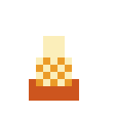
  
  
  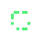
  
</p>

### Weapons & Shields

<p>
  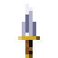
  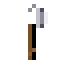
  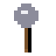
  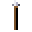
  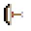
  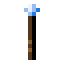
  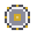
  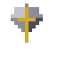
  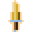
</p>

### Weapon Animations

<p>
  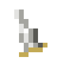
  
  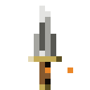
  
  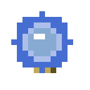
  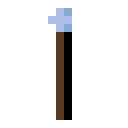
</p>

### Buildings & Structures

<p>
  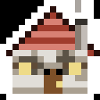
  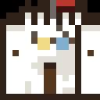
  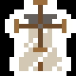
  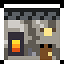
  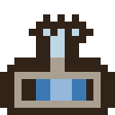
  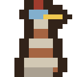
  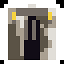
  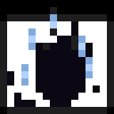
</p>

### Items & Terrain

<p>
  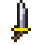
  
  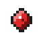
  
  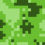
  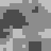
</p>

### Texture Atlas

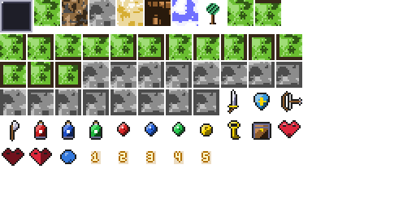

## Features

- **186 procedural assets** — characters, enemies, NPCs, terrain, items, UI, effects, natural objects, weapons & shields, buildings & structures
- **Animated sprite sheets** — variable frame timing, looping/one-shot, 4-directional movement
- **Multi-scale export** — 1x, 2x, 4x (or any custom scales like 3x, 8x)
- **JSON metadata** — frame counts, timing, hitboxes, anchors, recommended FPS
- **Texture atlas** — auto-packed with coordinate mappings
- **Animated GIF export** — preview animations at any scale
- **Hue-shift recoloring** — generate color variants without code changes
- **Seeded procedural generation** — deterministic output, change seed for variation
- **Quality profiles** — mobile (2x-4x, 2048 atlas) and desktop (1x-4x, 4096 atlas)
- **Selective generation** — filter by category, name, grep pattern, or exclusion
- **Pure Python** — only requires Pillow, no other dependencies

## Installation

```bash
git clone https://github.com/MozeeB/pixel-asset-gen.git
cd pixel-asset-gen
pip install Pillow
```

## Quick Start

```bash
# Generate all assets
python generate_assets.py

# See what's available
python generate_assets.py --list

# Generate specific category
python generate_assets.py --only objects

# Generate with animated GIF previews
python generate_assets.py --gif
```

## CLI Reference

### Filtering

```bash
--only player,objects,effects     # Select categories
--types rock_idle,tree_sway       # Select specific assets by name
--exclude slime_blue,slime_red    # Skip specific assets
--grep fire                       # Fuzzy search on asset names
```

### Output Control

```bash
--output ./my_assets              # Custom output directory
--scales 1,2,4,8                  # Custom scale factors
--profile mobile                  # Quality profile (mobile/desktop)
--gif                             # Export animated GIFs
--gif-scale 8                     # GIF scale factor (default: 4)
--no-atlas                        # Skip texture atlas
--no-metadata                     # Skip JSON metadata
```

### Procedural Control

```bash
--seed 999                        # Different seed for variation
--hue-shift 120                   # Recolor all sprites +120 degrees
```

### Inspection

```bash
--list                            # List all assets with details
--count                           # Asset count summary
--info rock_idle                  # Detailed info for one asset
--dry-run                         # Preview without writing files
--validate-only                   # Validate against quality profile
```

### Maintenance

```bash
--clean                           # Delete output dir before generating
-v, --verbose                     # Show all scale variants in output
```

## Usage Examples

```bash
# Mobile game build
python generate_assets.py --profile mobile --clean

# Desktop game build
python generate_assets.py --profile desktop --clean

# Quick prototype: just player + terrain
python generate_assets.py --only player,terrain --no-atlas

# Preview all animations as GIFs
python generate_assets.py --gif --gif-scale 8 --no-atlas

# Create themed biome variants
python generate_assets.py --hue-shift 0 --only terrain,objects --output ./forest
python generate_assets.py --hue-shift 30 --only terrain,objects --output ./desert
python generate_assets.py --hue-shift 200 --only terrain,objects --output ./ice
python generate_assets.py --hue-shift 330 --only terrain,objects --output ./volcanic

# Enemy difficulty color variants
python generate_assets.py --only enemies --hue-shift 0 --output ./enemies_normal
python generate_assets.py --only enemies --hue-shift 120 --output ./enemies_elite
python generate_assets.py --only enemies --hue-shift 240 --output ./enemies_boss

# Iterate on one asset with GIF preview
python generate_assets.py --only objects --types tree_sway --gif --gif-scale 8 --no-atlas

# Find all water-related assets
python generate_assets.py --grep water --list

# CI/CD validation
python generate_assets.py --profile mobile --validate-only
```

## Asset Categories

| Category | Key | Count | Description |
|----------|-----|-------|-------------|
| Player | `player` | 7 x 4 dirs | idle, walk, run, attack, jump, hit, death |
| Enemies | `enemies` | 21 | slime (x3 colors), skeleton, bat, ghost, goblin |
| NPCs | `npcs` | 4 | villager, merchant with animations |
| Terrain | `terrain` | 42 | 9 tile types + 32 autotile edge variants |
| Items | `items` | 13 | weapons, potions, gems, misc |
| UI | `ui` | 13 | hearts, health bars, buttons, inventory |
| Effects | `effects` | 24 | explosions, magic, particles, combos |
| Objects | `objects` | 12 | rock, sky, leaf, tree, water, grass |
| Weapons | `weapons` | 29 | melee, ranged, magic, shields, enchanted, rarity |
| Buildings | `buildings` | 21 | houses, castle, shops, church, windmill, ruins, more |

## Output Format

Each sprite generates:

```
name.png          # Spritesheet (horizontal strip of frames)
name_2x.png       # 2x nearest-neighbor scaled
name_4x.png       # 4x nearest-neighbor scaled
name.json         # Metadata (frames, timing, hitbox, anchor, FPS)
name_4x.gif       # Animated preview (with --gif)
```

### JSON Metadata

```json
{
  "name": "tree_sway",
  "frame_width": 16,
  "frame_height": 16,
  "frame_count": 8,
  "frame_duration_ms": 150,
  "loop": true,
  "hitbox": { "x": 2, "y": 0, "w": 13, "h": 16 },
  "anchor": { "x": 8, "y": 15 },
  "total_duration_ms": 1200,
  "effective_fps": 6.7,
  "recommended_fps": { "mobile": 8, "desktop": 8 }
}
```

## Quality Profiles

| Setting | Mobile | Desktop |
|---------|--------|---------|
| Scales | 2x, 3x, 4x | 1x, 2x, 4x |
| Target DPI | 326 | 96 |
| Max atlas | 2048x2048 | 4096x4096 |
| Min sprite | 16px | 16px |

## Project Structure

```
pixel-asset-gen/
  engine/
    drawing.py      # Pixel primitives, outlines, shading
    sprite.py       # SpriteSheet, DirectionalSprite, StaticSprite
    palette.py      # Color system with 3-tier shading
    noise.py        # Fractal noise for procedural textures
    metadata.py     # JSON export
    atlas.py        # Texture atlas packing
    quality.py      # Mobile/desktop quality profiles
    scaling.py      # Nearest-neighbor scaling
  sprites/
    player.py       # 7 player animations x 4 directions
    enemies.py      # 5 enemy types with variants
    npcs.py         # Villager, merchant
    terrain.py      # 9 tiles + 32 autotiles
    items.py        # Weapons, potions, gems
    ui.py           # Hearts, bars, buttons
    effects.py      # 24 visual effects
    objects.py      # 12 natural object animations
    weapons.py      # 29 weapons, shields, enchanted, rarity
    buildings.py    # 21 buildings & structures with animations
  generate_assets.py  # CLI entry point
  GUIDE.md            # Detailed usage guide
```

## How It Works

All sprites are generated programmatically using:

- **Sine waves** — oscillating motion (wobble, sway, waves, breathing)
- **Fractal noise** — organic textures (stone, clouds, canopy detail)
- **Physics simulation** — gravity, parabolic trajectories (crumbling, falling leaves)
- **HSL color math** — 3-tier shading (highlight/base/shadow) from single base colors
- **Hue rotation** — color variants without redrawing

No neural networks, no training data, no external assets. Every pixel is placed by math.

## Extending

Add new assets by creating generator functions:

```python
from engine.drawing import new_sprite, put_pixel, draw_outline
from engine.palette import OBJECTS
from engine.sprite import SpriteSheet

def generate_campfire() -> SpriteSheet:
    frames = []
    for f in range(8):
        img = new_sprite()  # 16x16 transparent RGBA
        # Draw your pixels...
        put_pixel(img, 7, 10, OBJECTS.base("fire_inner"))
        draw_outline(img)
        frames.append(img)
    return SpriteSheet("campfire", frames, frame_duration_ms=100, loop=True)
```

Add it to the module's `generate_all()` list and it auto-integrates with the full pipeline (PNG, JSON, atlas, GIF, scaling, hue-shift, filtering).

## Engine Compatibility

Assets are designed for easy import into:

- **Godot 4.x** — PNG sprite sheets + JSON metadata, 16x16 standard tile size
- **Unity** — slice sprite sheets using metadata coordinates
- **Phaser / PixiJS** — JSON frame data compatible
- **Any 2D engine** — standard PNG format with nearest-neighbor scaling

## License

MIT

## Contributing

Contributions welcome! See [GUIDE.md](GUIDE.md) for architecture details and how to add new asset types.
